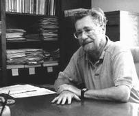
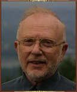

% Presentación de _Paper fundacional_
% A Debate on Teaching Computer Science - Dijkstra, Parnas y otros
% \today

# Introducción

## _A debate on teaching Computer Science_

* _ACM Computer Science Conference_, Febrero de 1989
* Dijkstra da una charla: _On the cruelty of really teaching computer science_
* _Communications of the ACM_ decide publicar una carta e invita a un debate entre
varias luminarias de las ciencias de la computación.
* Uno de ellos es David Parnas.
* La publicación se titula _A debate on teaching Computer Science_

## Dijkstra

## Parnas

# On the cruelty of really teaching Computer Science

## Reasoning by Analogy

> The underlying assumption of this talk is that computers
represent a radical novelity in our history.

* Usamos analogías para trabajar con los problemas relacionados con las
ciencias de la computación.
* Queremos que los cambios sean mínimos, que nuestra experiencia sirva.
* No es así con la computación...debemos reconocer que no vale el sentido común.
* Suprimir o ignorar la novedad: Razonamiento por analogía.
	* En la historia.
	* En la matemática.
	* En la educación.
* ¿Porqué es una novedad radical? Dos motivos: ...

## Radical Novelty

1. Magnitud del poder de cómputo.
	* Complejidad muy grande gracias a la escala de cómputo.
	* Jerarquías de conceptos muy profundas para esa escala.
	* Única tecnología: Abarca un incomensurable espacio. 
	* La analogía falla: ``es como una maquina de escribir''. Error grosero de _ratio_.
2. Dispositivo digital de gran escala
	* Comprensión humana más ajustada a sistemas analógicos.
	* Discretización produce que los comportamientos no sean interpolables.
	* Dificulta hacer suposiciones sobre lo desconocido.
	* La más mínima perturbación puede tener consecuencias drásticas.
	* Negar esta novedad es serio: perdidas de millones de dolares.

## The Doomed Discipline

* Supersitición de ponerle nombre a algo para controlarlo.
* Tratar de pensar a la computadora como cualquier dispositivo y a los programadores como
_craftsmen_ ordinarios:
	* Medir productividad en LOC (y mal hecha la cuenta: ¡Queremos menos, no más!)
	* Validación por _testing_ de programas como forma de pseudociencia.
	* _Mantenimiento de programas_: El código no se gasta...
	* Sobreenfasis en las herramientas (_programmer s workbench_), Dijkstra las ve como
	infantilizantes e insipidas animaciones.
* Ingeniería de Software: _snake oil business_.
* Inteligencia Artificial: Emular el cerebro humano, inferior al poder de la máquina.

## Enseñando Ciencias de la Computación

* La computadora puede solamente manipular símbolos y mostrar resultados de estas derivaciones.
* Un programa es un manipulador abstracto de símbolos que _resulta_ ser ejecutado en una máquina.
* Manipulación de símbolos: Ciencias de la Computación como rama de la Lógica, a gran escala.
* Visión no políticamente correcta para la academia.
* Consejo de Dijkstra:
	* No hablar de "bug". Hablar de "error". 
	* No antropomorfizar la máquina: 
		* Alejarnos de la semántica operacional. 
		* Razonar mediante la definición, no exhaustivamente.
	* Programación como demostración formal de teoremas. 
	* Evitar implementación y _testing_ en la enseñanza.

# Discusión: La respuesta de Parnas

## La respuesta de Parnas

* No es culpa de la Ing. del Soft. que haya malos libros.
* La ingeniería no es heurística: Enfasis en validación con métodos formales.
	* Falta de profesionalismo en las ciencias de la computación.
* Hay que entender los límites de los métodos formales.
	* _Testing_ como contraejemplo a una demostración.
	* Fallas en los axiomas del modelo frente a como funciona la máquina de verdad.
* Sensibilidad a cambios sutiles ya existe en otras disciplinas.
* Para la complejidad existe _Divide and Conquer_ como método.

# Nuestras conclusiones

## Porque nos parece importante.

* El paper nos parece fundacional o importante porque:
	* Enfoque novedoso a la enseñanza formal de la computación como ciencia.
	* Podemos ver su influencia en nuestra propia carrera (ej. Algoritmos I y II) 
	* Contexto Histórico:
		* C++, SmallTalk. OOP gana tracción.
		* Computadoras hogareñas, BASIC, Logo, aprendizaje constructivista.
		* AI Winter.
		* 1985-1987: Therac 25.
	* Hoy mismo tenemos el problema del software.
		* _healthcare.gov_: Un simple _sitio web_, si se lo quiere ver así.
	* Hoy mismo esta cambiando la educación: 
		* Treehouse, CodeAcademy, CodeSchool, Udemy, Udacity, ...

## Nuestras conclusiones: Julián

* Es impracticable la idea de "approach radical novelties with a blank mind".
* Tampoco es practicable demostrar la correctitud de todo programa. A mano es difícil, con computadora
es imposible (ejemplo _halting problem_).
* Tiene valor intentar simplificar los programas para hacerlos más fácilmente demostrables.
* No todo programa tiene requerimientos tan serios: Minecraft, Angry Birds.
* Conclusión de conclusiones: si bien en lineas generales estoy de acuerdo con lo que plantea Dijkstra, aplica demasiado al mundo académico. La computación no está acotada solo a eso.

## Nuestras conclusiones: Juan Pablo

* Ignora la aparición de Open Source y el software libre: Modelo colaborativo cuyo exito es difícil de explicar
a nivel ingeniería del software.
* Existe valor en la perspectiva de Dijkstra. Ejemplo: _Structure and Interpretation of Computer Programs_.
* Crítica al razonamiento por analogía  y antropomorfización del software me parece acertado.
* Las dimensiones con las que trabaja la computación siguen creciendo.

## Nuestras conclusiones: Vanesa

* A pesar de estar en desacuerdo con varios de los comentarios de Dijkstra
* Me parece interesante y útil su crítica:
	* Uno se replantea el porque uno hace lo que hace y porque lo hace de la forma en que lo hace.
	* ¿Tiene algún fundamento lo que uno hace?
	* ¿Qué transmito con lo que hago, enseño o métodos que uso?
